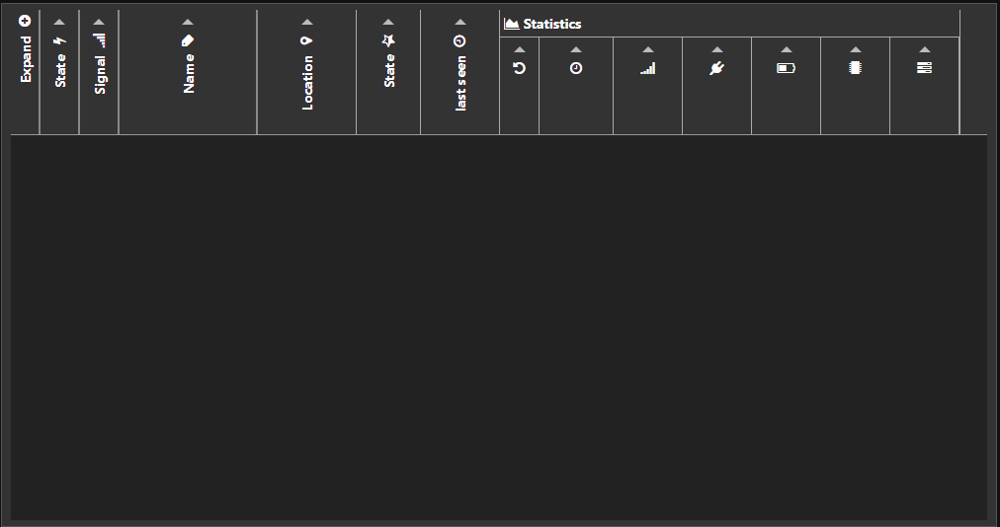
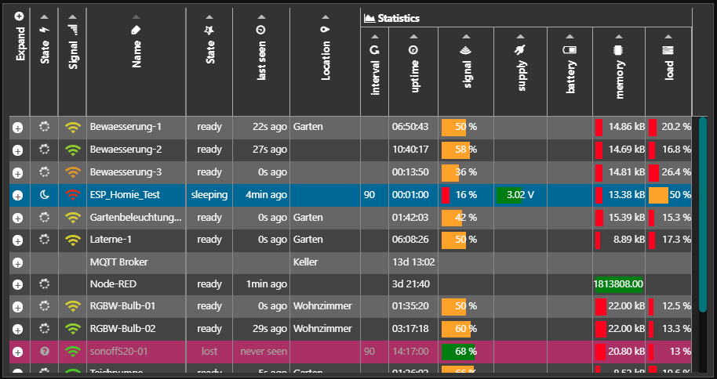
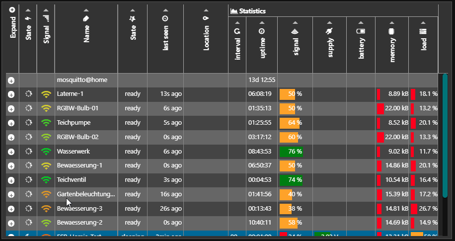
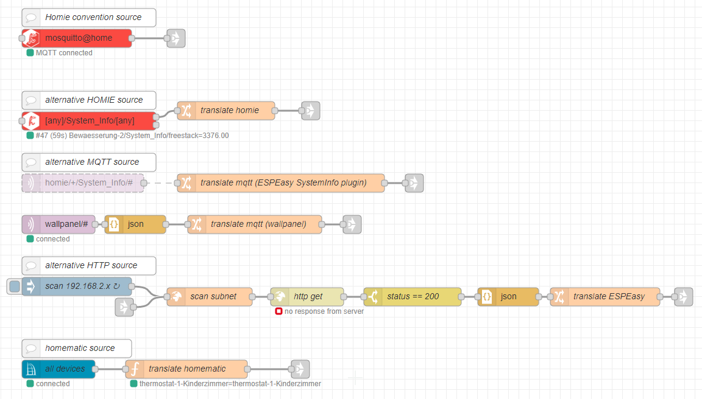
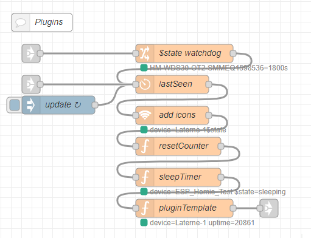
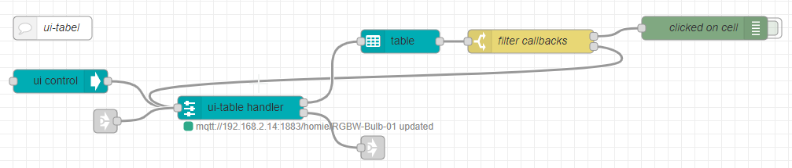
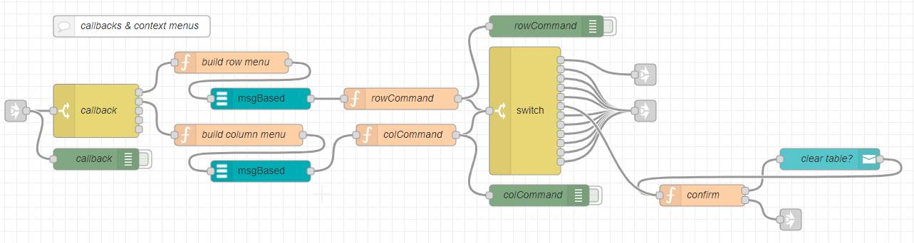

# remote-device-table
Node-RED flow to display the status of remote devices on the dashboard using ui-table

**first beta version**

## introduction
>In IOT or home automation environments there are normally many remote devices connected to Node-RED sometimes over wireless connections. This flow gives a dynamic overview of all devices with their last status messages and system health information.

## goals
- expandable
  - all kinds of data sources can be added using *translators*
  - data can be processed through *plugins*
  - table layout and functions can be configured
- easy to modify
  - no custom nodes which makes it difficult for normal users to do modifications
  - standard nodes wherever possible and useful
- reusable
  - function nodes should be reusable and easy to read
  - configuration through json objects instead if/switch statements
  - subflows with environment variables when a function node is more "complex"
- dynamic dashboard table
  - make use of the functionality of ui-table and the tabulator js module behind
  - only send updated data to keep traffic low
  - let ui-table do the display formatting so the flow only holds generic data and the screen display can be individually configured
- **contributions are highly appreciated**
  - new **translation nodes** for different devices or protocols
  - new or updated data **processing plugins** nodes
  - new or updated **table designs**
  - many parts of the flow contains only a draft layout and basic functions suggestions or PRs are always welcome.
- **documentation**
  - documentation in the nodes description tab so it is always available
  - documentation in source comments if useful
  - copy/paste documentation in the repro 
  - keep the docs up to date
- no database necessary
  - to make it easy to inspect all data it is hold in Node-RED context
  - keep data as close as possible to the node *(context.set instead of flow.set, no global.set)*
  - don't rely on data of other nodes as they could be "unplugged" or not available 
  - make use of the basic properties defined by the homie convention
  - as the flow is mostly dealing with live data use non volatile **file** memory only when useful (i.e. table edits or interactive layout modifications)
  - it is not expected that the flow is producing a huge amount of data. But many updates will occur, so quick access is the key.

## some nice features (most thanks to the tabulator module)

1. table population

   The table is filled and updated dynamically as data arrives. Only new or updated data is sent to the client
   

2. table-layout

   The table layout can be modified interactively. Beside changing the column width and order you can hide (and un hide) rows and columns.
   

3. responsive layout

   The table can be viewed with horizontal scroll (with frozen columns) or in a responsive layout
   

4. table edit

   The table cells can be edited (where suitable). The edits are stored separately and are prevented from overwrites
   

## theory of operation

The flow is divided in three main parts

1. **data acquisition**: translation of the data into homie and individual user defined fields (not everything fits into the homie convention but it is a good common ground). [different translator nodes can be found here](https://github.com/Christian-Me/remote-device-table/tree/master/translators)

2. **plugins**: little nodes doing all kind of stuff with this data. For example a watchdog, a reset counter, max. min. or avg. uptime, add icons from the values like battery or signal and other things. To make these reusable it is essential to have a common data-set defined. [different plugins can be found here](https://github.com/Christian-Me/remote-device-table/tree/master/plugins)

3. **table handling and ui design**: universal flow to handle table formatting, data storage, column width and order, cell editing and interactive stuff like context menus. [different designs can be found here](https://github.com/Christian-Me/remote-device-table/tree/master/table%20designs)

4. **callbacks & context menus**: ui-table callbacks are passed from the second output of the `ui-table handler` to this flow to do display context menus or other do other stuff

## flow design

- The flow starts with a msg coming in from mqtt / http or other sources in various shape or forms
- A translator node will process the data:
  - add a unique identifier to the message in msg.topic
  - add properties to the msg.state object 
    - using the predefined homie convention properties
    - adding new properties
    - filtering out not necessary or constant data
    - process data (i.e. signal strength form dB to %)
- the data then will be passed into the plugin sections through in/out nodes
- Data processing is like a stack of functions
  - there could be different entries to the stack. (i.e. mqtt devices can make use of the LWT functionality of the broker so they do not need the watchdog node)
  - adding new fields like icons
  - do other stuff with the data
- the final result will then be passed to the UI part of the flow
- the `ui-table handler` should do the heavy lifting 
  - send the data to the table
  - keep a copy of all data for tab changes or new clients connecting
  - store interactive layout changes
  - store interactive edits in the table
  - handle commands to alter the stored data or perform other things
  - handle context menus or callbacks form ui-table
- context menus are designed separately to enable individual designs

## homie convention

To define a common ground for all data this flow uses the [homie convention](https://homieiot.github.io/) which I highly recommend to take a closer look.

> For devices using the homie convention there is no translator node necessary and it is recommended to skip the `$state watchdog` plugin

The homie convention defines some statistic and firmware topics. The remote-device-table originates using the $stats and $fw properties The base dataset is defined by the homie convention [3.0.1](https://homieiot.github.io/specification/spec-core-v3_0_1/) and [4.0.0](https://homieiot.github.io/specification/spec-core-v4_0_0/) with [$state](https://github.com/homieiot/convention/blob/develop/extensions/documents/homie_legacy_stats_extension.md) and [$fw](https://github.com/homieiot/convention/blob/develop/extensions/documents/homie_legacy_firmware_extension.md) extensions. 
If an alternative source provides all or some of the data it should first try to use the existing properties and perform conversions if necessary.

## reserved properties
property | description | type    | format 
-------- | ----------- | ------- | ------ 
$homie | The implemented Homie convention version | string | "4.0.0"
$name | the **unique** name of the device. This name is used to identify the device in the table. | string | "myDevice"
$state | current or last state of the device | string | ["ready", "lost", "init", "sleeping", "disconnected", "alert"]
$nodes	| Nodes the device exposes | array | comma seperated list
$extensions	| Supported extensions | array | comma seperated list
$implementation | An identifier for the Homie implementation | string | "esp8266"

defined by [**Legacy Firmware**](https://github.com/homieiot/convention/blob/develop/extensions/documents/homie_legacy_firmware_extension.md)

property | description | type    | format
-------- | ----------- | ------- | ------
$localip | IP of the device on the local network | string | "127.0.0.1"
$mac | Mac address of the device network interface | string | The format MUST be of the type `A1:B2:C3:D4:E5:F6`
name | Name of the firmware running on the device. | string | Allowed characters are the same as the device ID
version | Version of the firmware running on the device. | string | "1.0.0"

defined by [**Legacy Stats**](https://github.com/homieiot/convention/blob/develop/extensions/documents/homie_legacy_stats_extension.md)

property | description | type    | format
-------- | ----------- | ------- | ------
interval | Interval in seconds at which the device refreshes its `$stats/+` | integer | Positive greater 0
uptime | Time elapsed in seconds since the boot of the device | integer | seconds
signal | Signal strength | Integer | in %
cputemp | CPU Temperature | Float | in °C
cpuload | CPU Load in. Average of last $stats\interval including all CPUs | Integer | %. 
battery | Battery level. | Integer | in %
freeheap | Free heap. |	Positive Integer | in bytes
supply | Supply Voltage | Float | in V

