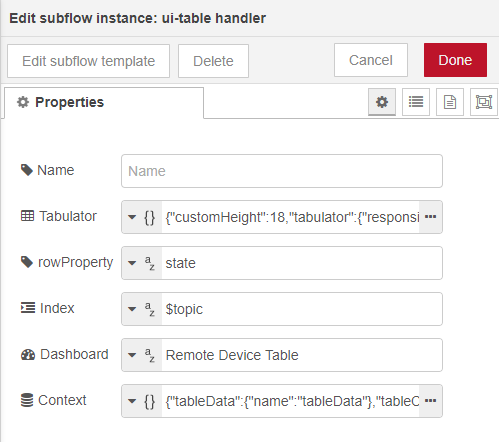

# ui-table handler
Universal handler for ui-table.
## features
- buffer table data
- add or update individual rows or cells of the table
- delete rows
- clear tableData
- handle column width
- handle column order

## configuration



- `tabulator` json formatted object containing configuration of the table. See ui-table for more details.
- `rowProperty` property of the msg object that contains the data to be passed to ui-table. I.e. *state* `msg.state`
- `index` index column to identify individual rows. Each message containing data must have a unique `msg.topic` to identify the row. 
  
  Messages without this `msg.topic` will be droped. It is not nessesary but possible to display the index column in the table. Do not enable editing on this column otherwise you will loose the connection and another row will be added to the table as soon as a new message arrives!

   Defaults to *$topic* `msg.state.$topic`
- `dashboard` name of the dashboard tab to only update the table if the dashboard is visible. If empty the table will be updated on every tab change and connect.
- `context` configuration of context data. The subflow will save or cache data in the flows context using `$parent.`. 
   **tableData** caches the incoming data to restore it on `ui-control´ *change* messages.
   **tableConfig** saves column width and order to save the interactive table layot
   **tableEdit** saves edits on the table data otherwise it would be overwritten when new data arrives
```json
{
    "tableData": {
        "name": "tableData"
    },
    "tableConfig": {
        "name": "tableConfig",
        "storage": "file"
    },
    "tableEdit": {
        "name": "tableEdit",
        "storage": "file"
    }
}
```

## commands
commands can be passed by sending a object as `msg.payload`. All currently used commands are available by context menus. Use debug nodes to inspect the process.

- delete custom colum order and restore colum order from the tabulator json. This is important if you add or delete columns in the tabulator config otherwise the columns most likely don`t show up (due to imperfect implementation of manipulating the ui_control object by a column sort array = collumns not in this array will never show up untill the columOrder array is deleted ToDo!)

    `msg.payload={"command": "restoreColumnOrder"}`

- delete custom column widths 

    `msg.payload={"command": "resetColumnWidth"}`
- delete tableCache (tableData) this command should be send through all plugins to give them a fresh start too.
    
    `msg.payload={"command": "deleteTable"}`
- refresh table from Cache 
    
    `msg.payload={"command": "refreshTable"}`
- deletes a device from Cache. If the device is still alive it will showup as soon as a new message arrive.
    
    `msg.payload={"command": "deleteDevice","object":"deviceId/index"}`
- Put it on an ignore list. New messages from this device will be ignored.
    
    `msg.payload={"command": "ignoreDevice","object":"deviceId/index"}`
- removes a device from the ignore list. New messages from this device will showup again.
    
    `msg.payload={"command": "unIgnoreDevice","object":"deviceId/index"}`
- removes all devices from the ignore list. All devices will showup again.
    
    `msg.payload={"command": "unIgnoreDevices"}`
- hide a column from the table
    
    `msg.payload={"command": "columnHide","object":"column title"}`
- un hide a column from the table
    
    `msg.payload={"command": "columnUnHide","object":"column title"}`

## commands form context menus

- update command to data acquisition for nodes capable of active data polls like http requests
    
    `msg.payload={"command": "updateDevice","object":"deviceId/index"}`

## background
ui-table warps the powerful tabluator library. This subflow makes it easier to unleash the powerful features of ui-table